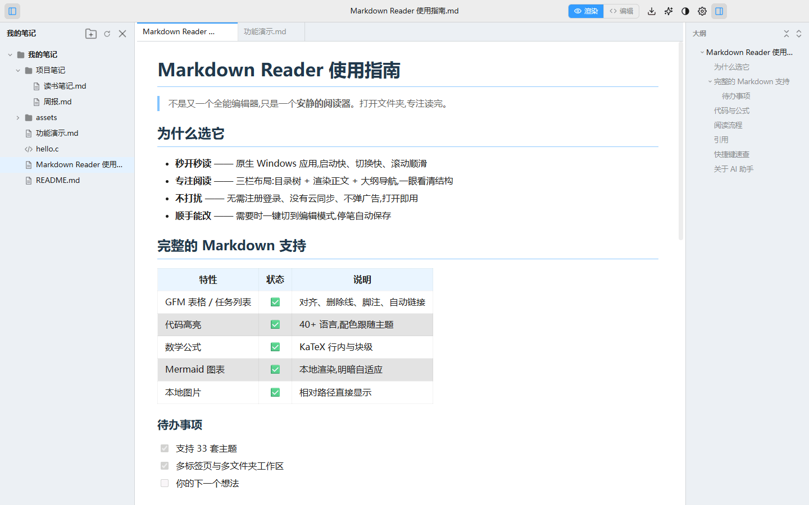
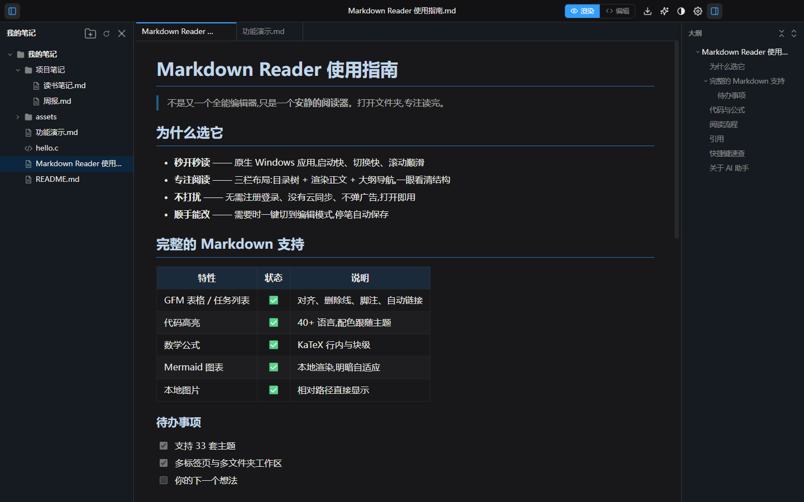
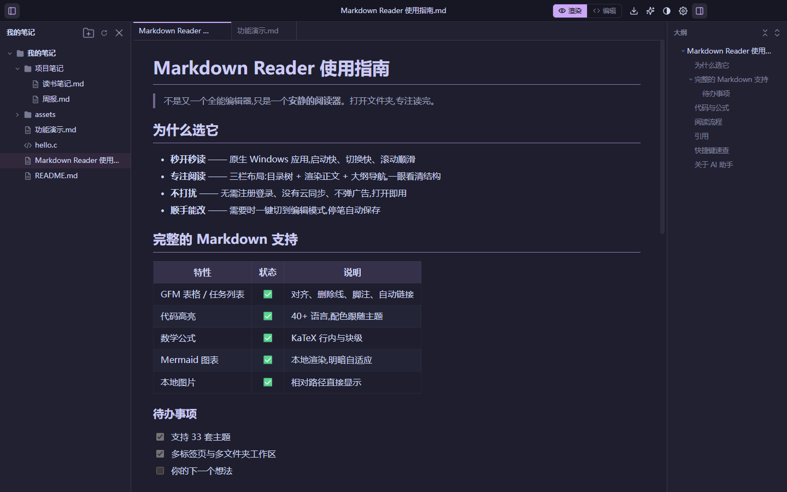
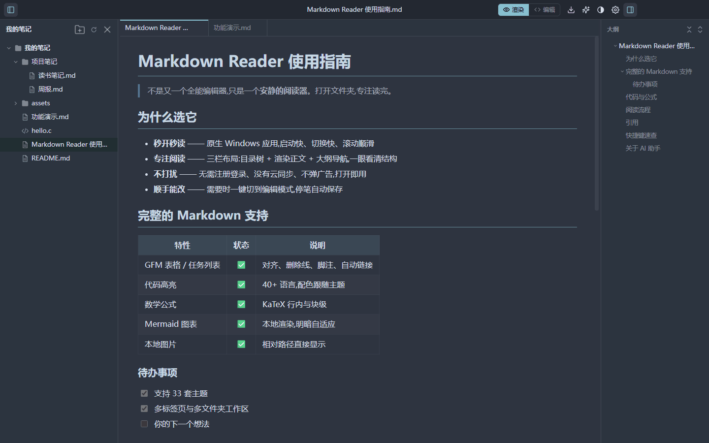
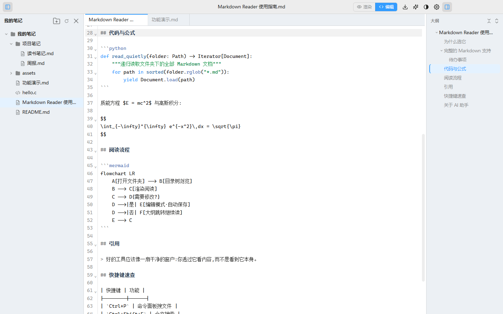
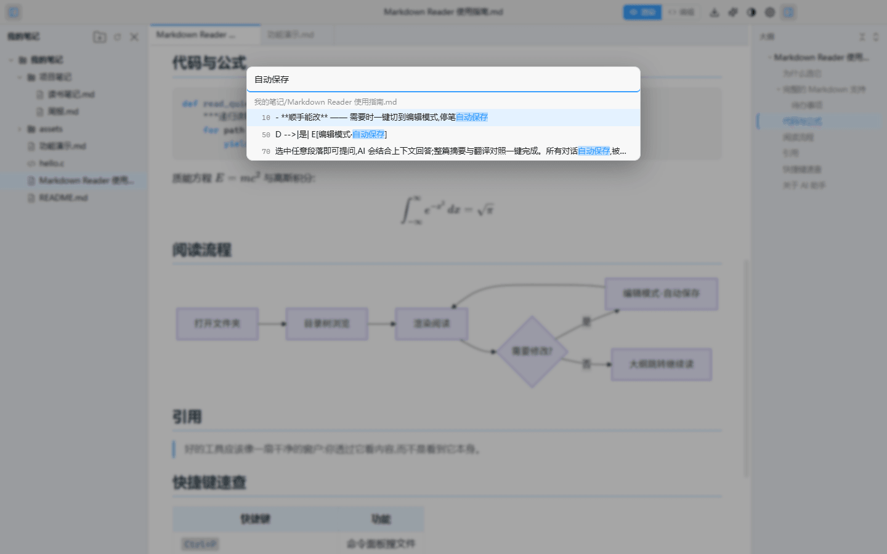
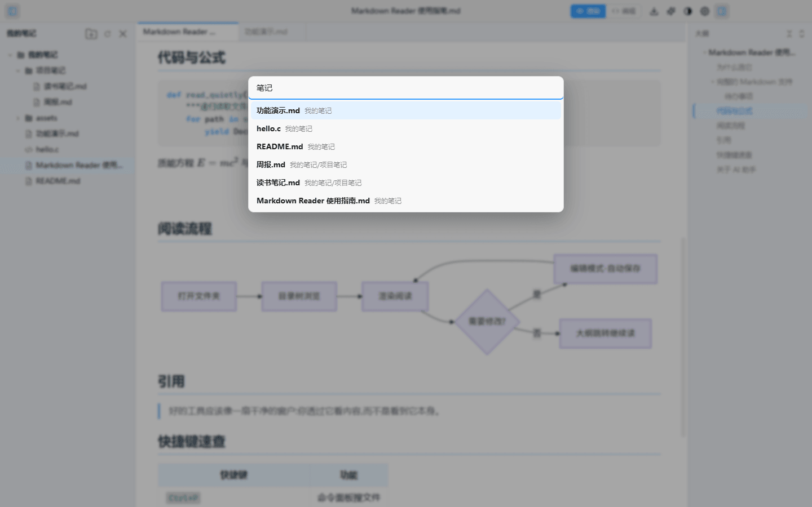
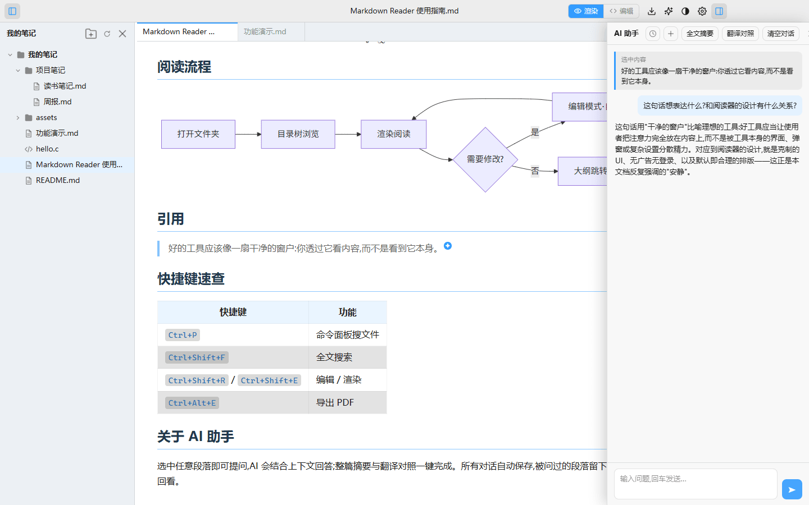
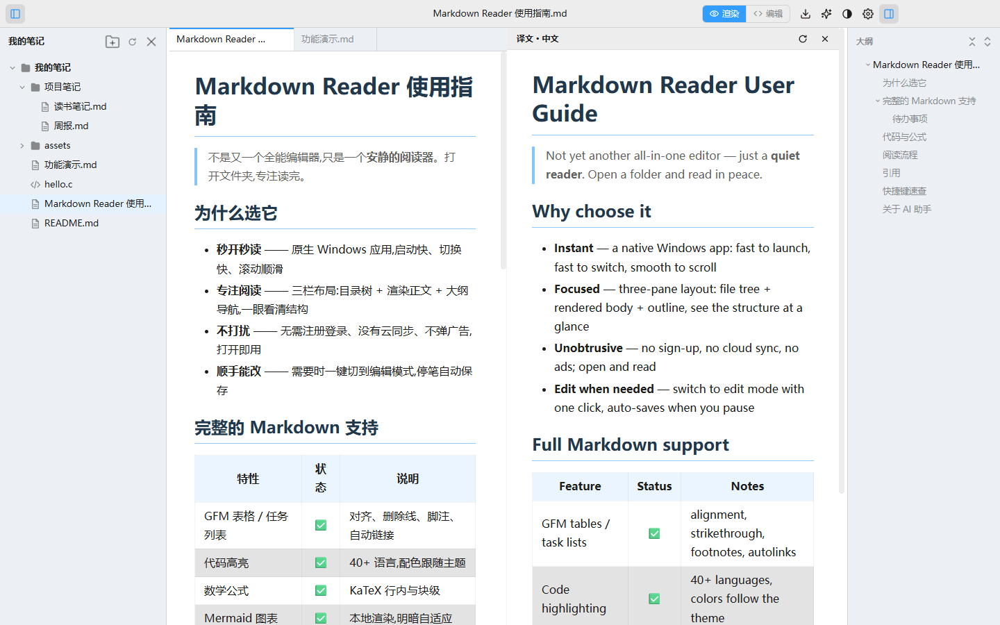
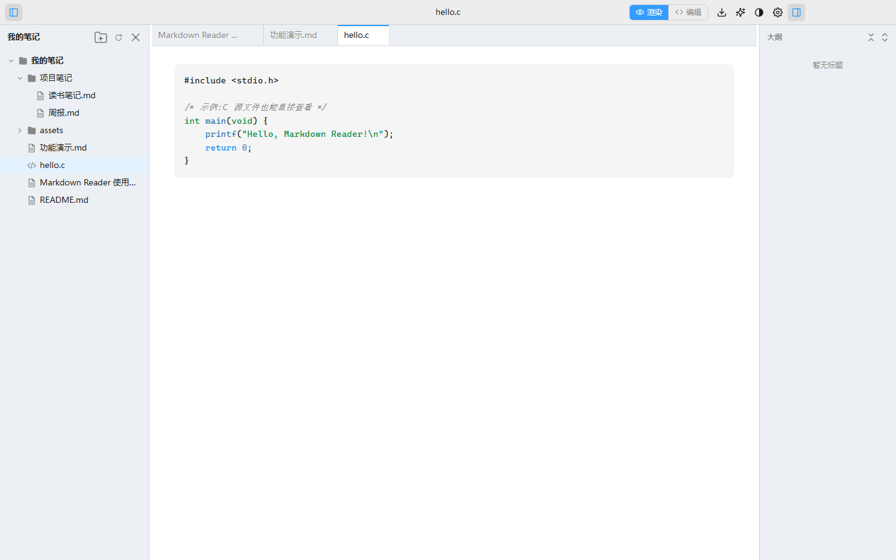

<div align="center">


# Markdown Reader for Windows

**不是又一个全能编辑器,只是一个安静的 Markdown 阅读器。**

打开文件夹,专注读完。需要时顺手改两笔,停笔自动保存。

[](https://github.com/haha0510/MarkdownReader-Win/releases/latest)
[](https://github.com/haha0510/MarkdownReader-Win/releases)
[](LICENSE)


[⬇ 下载安装版](https://github.com/haha0510/MarkdownReader-Win/releases/latest/download/MarkdownReader-Setup-0.5.0.exe) · [⬇ 下载便携版](https://github.com/haha0510/MarkdownReader-Win/releases/latest/download/MarkdownReader-Portable-0.5.0.exe) · [功能一览](#功能一览) · [快捷键](#快捷键) · [English](#english)



</div>

---

## 为什么做这个

市面上的 Markdown 工具越来越重:实时协作、云同步、插件生态……但大多数时候,你只是想**双击一个 .md 文件,安安静静地读完它**。

Markdown Reader 就是为这个场景而生——

- **秒开秒读** —— 启动快、切换快,文档再长滚动也顺滑
- **专注阅读** —— 目录树 + 正文 + 大纲 三栏布局,一眼看清文档结构
- **没有负担** —— 不注册、不登录、不联网(AI 功能除外)、不弹广告
- **顺手能改** —— 一键切到编辑模式,停笔自动保存,改完切回继续读

它是 macOS 开源项目 [davidhoo/MarkdownReader](https://github.com/davidhoo/MarkdownReader) 的 Windows 版本,在此基础上加入了多标签页、全文搜索、AI 助手、代码文件查看等功能。

---

## 功能一览

### 🎨 33 套精心调配的主题,跟随系统明暗

20 套深色 + 13 套浅色,包含 Catppuccin、Nord、Dracula、Tokyo Night、Gruvbox、One Dark、GitHub 等流行配色。主题不只是换背景色——标题栏、侧栏、正文三层层次分明,标题、代码、引用、表头都带上主题色。

<table>
<tr>
<td width="33%"><p align="center"><sub>Default Dark</sub></p></td>
<td width="33%"><p align="center"><sub>Catppuccin Mocha</sub></p></td>
<td width="33%"><p align="center"><sub>Nord</sub></p></td>
</tr>
</table>

### 📝 完整的 Markdown 渲染

GFM 表格、任务列表、脚注、删除线、自动链接;**36+ 种语言代码高亮**;**KaTeX** 数学公式;**Mermaid** 流程图/时序图/甘特图本地渲染并跟随明暗主题;PlantUML;文档相对路径的本地图片直接显示。

### ✏️ 阅读与编辑无缝切换

点「编辑」进入 CodeMirror 编辑器,**自动定位到你正在读的章节**;编辑时大纲照常可用,新增的标题实时出现;停笔约 1 秒**自动保存**;切回「渲染」回到同一位置。还有 `Ctrl+B` 加粗、`Ctrl+I` 斜体。



### 🔍 全文搜索与命令面板

`Ctrl+Shift+F` 搜索所有已打开文件夹里**每一篇文档的内容**,结果按文件分组、关键词高亮,回车直达段落。`Ctrl+P` 模糊搜文件名,敲几个字母就能切换文档。

<table>
<tr>
<td width="50%"><p align="center"><sub>全文搜索</sub></p></td>
<td width="50%"><p align="center"><sub>命令面板</sub></p></td>
</tr>
</table>

### ✨ AI 助手:选中即问、全文摘要、翻译对照

接入任何 **OpenAI 兼容接口**(DeepSeek、OpenAI、通义千问、本地 Ollama……),填上地址、密钥、模型名即可用:

- **选中即问** —— 在正文里选中一段文字,点浮动按钮提问,AI 结合上下文回答;被问过的段落留下 ✦ 标签,随时点开回看当时的问答
- **全文摘要** —— 一键总结整篇文档
- **翻译对照** —— 左原文、右译文分栏对照阅读
- 所有对话**自动保存**,可回看、可继续追问

<table>
<tr>
<td width="50%"><p align="center"><sub>选中即问(注意正文中的 ✦ 批注标签)</sub></p></td>
<td width="50%"><p align="center"><sub>翻译对照阅读</sub></p></td>
</tr>
</table>

### 📂 多标签、多文件夹、拖拽管理

同窗口打开多个标签页(`Ctrl+Tab` 切换);同时打开多个文件夹组成工作区;目录树里**直接拖拽**移动文件;右键新建、重命名、删除(进回收站);外部修改自动刷新。

### 💻 代码与文本文件也能看

文件夹里的 `.c` `.cpp` `.py` `.js` `.json` `.yaml` `.sh` 等 **50+ 种**源文件一并显示在目录树里,点开即有语法高亮,同样可以编辑和搜索。不想看到?设置里一键关闭。



### 还有这些

| | |
|---|---|
| 🗂 **大纲导航** | 标题层级树,可折叠,滚动联动高亮,点击跳转 |
| 🖼 **图片灯箱** | 点击图片全屏查看,滚轮缩放 |
| 📄 **导出 PDF / 打印** | 只输出正文,保留样式 |
| 💾 **会话恢复** | 记住上次的文件夹、文件、滚动位置、标签页、窗口大小 |
| 🌏 **三语界面** | 简体中文 / 繁體中文 / English,跟随系统或手动指定 |
| 🔗 **文件关联** | 安装版关联 `.md`,双击即开;文件或文件夹拖进窗口也能打开 |
| 🔒 **安全** | 本地图片经专用协议加载,只允许访问已打开目录内的文件 |

---

## 安装

**系统要求:** Windows 10 / 11(64 位)

| 方式 | 下载 | 说明 |
|---|---|---|
| **安装版(推荐)** | [MarkdownReader-Setup-0.5.0.exe](https://github.com/haha0510/MarkdownReader-Win/releases/latest/download/MarkdownReader-Setup-0.5.0.exe) | 可选安装目录,创建桌面快捷方式,**自动关联 .md 文件** |
| **便携版** | [MarkdownReader-Portable-0.5.0.exe](https://github.com/haha0510/MarkdownReader-Win/releases/latest/download/MarkdownReader-Portable-0.5.0.exe) | 单文件免安装,可放 U 盘;不带文件关联 |

> **首次运行会看到 Windows SmartScreen 蓝色提示**(因为没有购买代码签名证书),点「**更多信息**」→「**仍要运行**」即可。软件完全开源,代码就在这个仓库里。

### 三步上手

1. 打开软件,点「打开文件夹」选一个放 Markdown 文档的目录(或者直接把文件夹**拖进窗口**)
2. 左侧目录树点文件阅读,右侧大纲点标题跳转
3. 想改?点标题栏「编辑」;想换肤?点 ◐ 图标或进设置选主题

### 配置 AI(可选)

设置(`Ctrl+,`)→ AI 助手,填三项:

| 项目 | 示例(DeepSeek) |
|---|---|
| 接口地址 | `https://api.deepseek.com` |
| API Key | `sk-xxxxxxxx` |
| 模型 | `deepseek-chat` |

任何 OpenAI 兼容接口都可以,包括本地部署的 Ollama / LM Studio。密钥只保存在你的电脑上。

---

## 快捷键

| 快捷键 | 功能 | | 快捷键 | 功能 |
|---|---|-|---|---|
| `Ctrl+O` | 打开文件 | | `Ctrl+Shift+E` | 渲染模式 |
| `Ctrl+Shift+O` | 打开文件夹 | | `Ctrl+Shift+R` | 编辑模式 |
| `Ctrl+N` | 新建文件 | | `Ctrl+S` | 保存(默认已自动保存) |
| `Ctrl+P` | 命令面板(搜文件) | | `Ctrl+B` / `Ctrl+I` | 加粗 / 斜体(编辑时) |
| `Ctrl+Shift+F` | 全文搜索 | | `Ctrl+F` / `F3` | 页内查找 / 下一个 |
| `Ctrl+Tab` / `Ctrl+W` | 切换 / 关闭标签页 | | `Ctrl+Alt+E` | 导出 PDF |
| `Ctrl+\` | 侧栏开关 | | `Ctrl+Shift+\` | 大纲开关 |
| `Ctrl+=` / `Ctrl+-` / `Ctrl+0` | 缩放 | | `Ctrl+,` | 设置 |

---

## 常见问题

**Q: 为什么渲染视图里打字没反应?**
渲染视图是只读的阅读模式。点标题栏的「编辑」(或 `Ctrl+Shift+R`)进入编辑模式。

**Q: 大文件会卡吗?**
超过 1MB 的代码文件自动降级为纯文本显示以保证流畅;Markdown 文档经实测数千行无压力。

**Q: 我的设置和 AI 对话记录存在哪?**
`%APPDATA%\Markdown Reader\` 目录下的 JSON 文件,卸载软件不会自动删除,方便重装后恢复。

**Q: 可以用在 Mac 上吗?**
请使用原版 [davidhoo/MarkdownReader](https://github.com/davidhoo/MarkdownReader)(macOS 原生,SwiftUI 实现)。

---

## 参与开发

```bash
git clone https://github.com/haha0510/MarkdownReader-Win.git
cd MarkdownReader-Win
npm install          # .npmrc 已配置 Electron 国内镜像
npm run dev          # 开发模式(热更新)
npm run build        # 构建到 out/
npm run e2e          # Playwright 驱动真实应用的端到端测试(需先 build)
npm run dist         # 打包 NSIS 安装包 + 便携版到 dist/
```

**技术栈:** Electron 38 · TypeScript(strict)· 无前端框架,原生 DOM · markdown-it · CodeMirror 6 · highlight.js · KaTeX · Mermaid

**架构:**

```
src/
├─ shared/     类型与 IPC 通道契约(main / preload / renderer 三方共享)
├─ main/       主进程:窗口、文件系统、目录监控、mdr:// 协议、持久化、PDF、AI 流式转发
├─ preload/    contextBridge 暴露 window.api(sandbox + contextIsolation)
└─ renderer/   渲染器
   ├─ state.ts / bus.ts   极简响应式 store + 事件总线
   ├─ markdown/           markdown-it 管线、mermaid、plantuml
   ├─ theme/              33 主题 + 派生算法(5 基色 → 全套语义色)
   ├─ components/         标题栏 / 文件树 / 大纲 / 阅读器 / 编辑器 / 搜索 / AI 面板 …
   └─ i18n/               三语字典
```

`design/` 目录保存了从原版提取的设计规格(主题色值与派生公式、渲染行为、UI 规格、全量文案),是跨平台保持一致的依据。`tests/` 下有 10+ 个端到端测试脚本,覆盖渲染、编辑、搜索、AI、拖拽等主要流程。

欢迎提 [Issue](https://github.com/haha0510/MarkdownReader-Win/issues) 反馈问题或建议,也欢迎 PR。

---

## 致谢

- [davidhoo/MarkdownReader](https://github.com/davidhoo/MarkdownReader) —— 原版 macOS 应用,本项目的设计蓝本与主题体系来源
- [markdown-it](https://github.com/markdown-it/markdown-it) · [CodeMirror](https://codemirror.net/) · [highlight.js](https://highlightjs.org/) · [KaTeX](https://katex.org/) · [Mermaid](https://mermaid.js.org/) · [Electron](https://www.electronjs.org/)

## 许可

[MIT](LICENSE)

---

## English

**A quiet Markdown reader for Windows.** Not yet another all-in-one editor — open a folder and just read.

- **Three-pane layout**: file tree · rendered view · collapsible outline
- **Full Markdown**: GFM, 36+ language syntax highlighting, KaTeX math, Mermaid diagrams, local images
- **33 themes** (20 dark / 13 light) following system dark mode
- **Edit mode** with auto-save and render↔edit position sync
- **Multi-tab, multi-folder workspace**, drag-to-move files in tree
- **Full-text search** (`Ctrl+Shift+F`) and command palette (`Ctrl+P`)
- **AI assistant** via any OpenAI-compatible API: ask about selection, summarize, side-by-side translation — with saved history and inline ✦ annotations
- **View & edit code/text files** (`.c` `.py` `.js` `.json` … 50+ types)
- PDF export & print · zh-Hans / zh-Hant / English UI

**Download:** [Installer](https://github.com/haha0510/MarkdownReader-Win/releases/latest/download/MarkdownReader-Setup-0.5.0.exe) · [Portable](https://github.com/haha0510/MarkdownReader-Win/releases/latest/download/MarkdownReader-Portable-0.5.0.exe) — Windows 10/11 x64. On first launch, dismiss the SmartScreen warning via *More info → Run anyway* (the binary is unsigned; source is right here).
