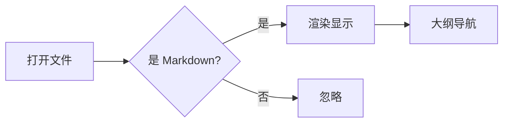
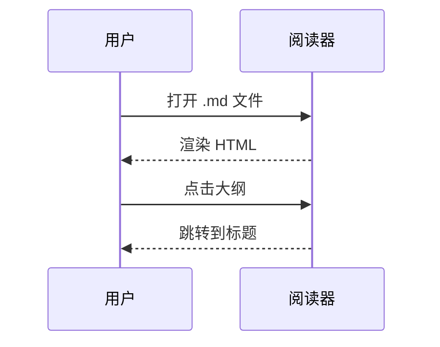

# Markdown Reader 功能演示

> 这是一个**测试文档**,覆盖阅读器支持的全部语法特性。

## 基础排版

段落文字,包含 **粗体**、*斜体*、~~删除线~~、`行内代码`、[外部链接](https://github.com)、[内部文档](./子目录/嵌套文档.md)。

自动链接:https://example.com

## 列表

- 无序列表项一
- 无序列表项二
  - 嵌套项
    - 更深嵌套

1. 有序列表
2. 第二项

### 任务列表

- [x] 已完成任务
- [ ] 待办任务
- [ ] 另一个待办

## 表格

| 功能 | 状态 | 说明 |
|------|:----:|------|
| GFM 表格 | ✅ | 对齐支持 |
| 代码高亮 | ✅ | highlight.js |
| 数学公式 | ✅ | KaTeX |
| Mermaid | ✅ | 本地渲染 |

## 代码高亮

```python
def fibonacci(n: int) -> int:
    """计算斐波那契数列"""
    if n <= 1:
        return n
    return fibonacci(n - 1) + fibonacci(n - 2)

print([fibonacci(i) for i in range(10)])
```

```typescript
interface User {
  name: string
  age: number
}
const greet = (u: User): string => `Hello, ${u.name}!`
```

```c
#include <stdio.h>
int main(void) {
    printf("Hello, Markdown Reader!\n");
    return 0;
}
```

## 数学公式

行内公式:$E = mc^2$,以及 $\sum_{i=1}^{n} i = \frac{n(n+1)}{2}$。

块级公式:

$$
\int_{-\infty}^{\infty} e^{-x^2} \, dx = \sqrt{\pi}
$$

## Mermaid 图表





## 引用与分割线

> 引用块第一层
> > 嵌套引用
>
> 引用中的 `代码` 和 **粗体**

---

## 脚注

这里有一个脚注引用[^1],还有另一个[^note]。

[^1]: 这是第一个脚注的内容。
[^note]: 这是具名脚注。

## 图片


## 长内容滚动测试

### 小节 A

Lorem ipsum dolor sit amet, consectetur adipiscing elit. 中文内容混排测试,验证行高与字距。

### 小节 B

更多内容用于测试大纲滚动联动(scrollspy)。

### 小节 C

最后一节。

## HTML 内联

<details>
<summary>点击展开详情</summary>

隐藏的内容,支持 **markdown**。

</details>

<kbd>Ctrl</kbd> + <kbd>P</kbd> 打开命令面板。
