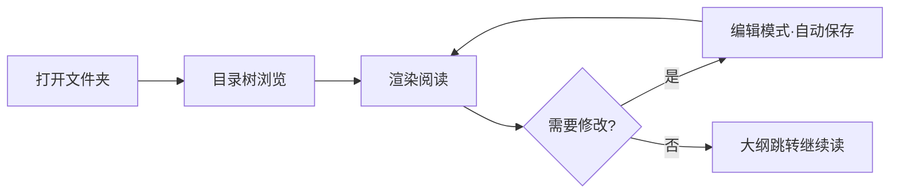

# Markdown Reader 使用指南

> 不是又一个全能编辑器,只是一个**安静的阅读器**。打开文件夹,专注读完。

## 为什么选它

- **秒开秒读** —— 原生 Windows 应用,启动快、切换快、滚动顺滑
- **专注阅读** —— 三栏布局:目录树 + 渲染正文 + 大纲导航,一眼看清结构
- **不打扰** —— 无需注册登录、没有云同步、不弹广告,打开即用
- **顺手能改** —— 需要时一键切到编辑模式,停笔自动保存

## 完整的 Markdown 支持

| 特性 | 状态 | 说明 |
|------|:----:|------|
| GFM 表格 / 任务列表 | ✅ | 对齐、删除线、脚注、自动链接 |
| 代码高亮 | ✅ | 40+ 语言,配色跟随主题 |
| 数学公式 | ✅ | KaTeX 行内与块级 |
| Mermaid 图表 | ✅ | 本地渲染,明暗自适应 |
| 本地图片 | ✅ | 相对路径直接显示 |

### 待办事项

- [x] 支持 33 套主题
- [x] 多标签页与多文件夹工作区
- [ ] 你的下一个想法

## 代码与公式

```python
def read_quietly(folder: Path) -> Iterator[Document]:
    """递归读取文件夹下的全部 Markdown 文档"""
    for path in sorted(folder.rglob("*.md")):
        yield Document.load(path)
```

质能方程 $E = mc^2$ 与高斯积分:

$$
\int_{-\infty}^{\infty} e^{-x^2}\,dx = \sqrt{\pi}
$$

## 阅读流程



## 引用

> 好的工具应该像一扇干净的窗户:你透过它看内容,而不是看到它本身。

## 快捷键速查

| 快捷键 | 功能 |
|--------|------|
| `Ctrl+P` | 命令面板搜文件 |
| `Ctrl+Shift+F` | 全文搜索 |
| `Ctrl+Shift+R` / `Ctrl+Shift+E` | 编辑 / 渲染 |
| `Ctrl+Alt+E` | 导出 PDF |

## 关于 AI 助手

选中任意段落即可提问,AI 会结合上下文回答;整篇摘要与翻译对照一键完成。所有对话自动保存,被问过的段落留下 ✦ 标签,随时回看。
